# TRAIN_SCANNER

The main goal is to create a real time system (Raspberry pi) that receive data and perform detection. Once the detection done the result is sent back to a computer.
The model used in the Raspberry is trained in a normal computer (no cloud needeed) and results are composed of different metrics and consumption analysis.


# Table of Contents
- [Sources](#sources)
- [Data Sources](#data-sources)
- [Getting started](#getting-started)
- [Handling the dataset](#handling-the-dataset)
- [Training](#training)
- [Rapberry pi](#raspberry-pi)
- [Communication](#communication)
- [Future and improvments](#future-and-improvments)

# Sources 

[Ultralytics/Yolo](https://docs.ultralytics.com/fr/), [mlflow](https://mlflow.org/), [pytorch](https://pytorch.org/), [openvino](https://github.com/openvinotoolkit/openvino), [pi software](https://www.raspberrypi.com/software/), [tar,gz files](https://doc.ubuntu-fr.org/tar), [h5 format](https://www.hdfgroup.org/solutions/hdf5/), [curl](https://curl.se/), [raspberry imager](https://www.raspberrypi.com/software/)


# Data Sources

I will use FRSIGN dataset : [FRSIGNDATASET](https://frsign.irt-systemx.fr/)

>@ARTICLE{2020arXiv200205665H,
       author = {{Harb}, Jeanine and {R{\'e}b{\'e}na}, Nicolas and {Chosidow}, Rapha{\"e}l and {Roblin}, Gr{\'e}goire and {Potarusov}, Roman and {Hajri}, Hatem},
        title = "{FRSign: A Large-Scale Traffic Light Dataset for Autonomous Trains}",
      journal = {arXiv e-prints},
     keywords = {Computer Science - Computers and Society, Computer Science - Computer Vision and Pattern Recognition, Computer Science - Machine Learning},
         year = "2020",
        month = "Feb",
          eid = {arXiv:2002.05665},
        pages = {arXiv:2002.05665},
archivePrefix = {arXiv},
       eprint = {2002.05665},
 primaryClass = {cs.CY},
       adsurl = {https://ui.adsabs.harvard.edu/abs/2020arXiv200205665H},
      adsnote = {Provided by the SAO/NASA Astrophysics Data System}
}
>


# Getting Started

To use this repo you need to:
1. Download the Dataset and copy it in ./data
2. pip install requirements.txt
3. Run ./data/extract_data then ./data/order_data to create a yolo type dataset
4. Train the model using ./src/training/train.py
5. Convert the model using ./model/convert.py (you will need to put the path of the .pt of your trainning)
6. Create a folder on the pi with paho.mqtt, YOLO, openCV
7. Follow the configuration steps for the connection
8. Start pi_inference.py

# Handling the dataset

The dataset (in a .tar.gz format) is more than 250Go. I just want to do a Proof of Concept. And the issue is i do not have that much place on my computer so i will need to adapt.

First I need to Download it 
The goal is having a Implement a resilient download strategy with auto-resume capabilities to ensure dataset integrity over my unstable and slow wifi:

```bash
>>     curl.exe -L -C - -O https://frsign.irt-systemx.fr/download/FRSign.tar.gz
>>     if ($LASTEXITCODE -ne 0) {
>>         Write-Host "Connexion perdue. Relance dans 5 secondes..."
>>         Start-Sleep -s 5
>>        }
>> } while ($LASTEXITCODE -ne 0)

```
To know:
- .tar format: (tape archiver). Group files in one block easier to move and transfer
- .gz format: A compression format
- .h5 Organisation of the dataset in a hierarchical data format. I can extract ditinc part if I need

***For the beginning i will only do detection without using sign offtrack so the dataset is only composed of ontracks images to make a model easier to train***

## Organisation 
From the Arxchiv and jupyter we can sum up the organisation as:
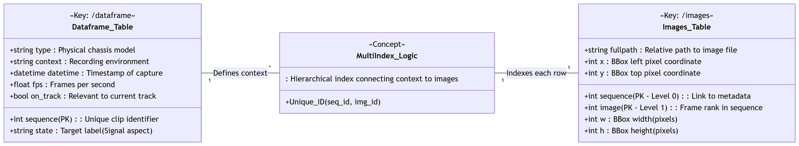

In the images table, each row represents a single bounding box (BBox) associated with a unique combination of a sequence key and an image key

## Table of contents 

From the jupyter file we can see there is a 'table of contents' in the .h5 file. To create a smaller Dataset i will use that.

We can see it's only 14Mo. So i need to extract it.

Now i have a frsign_v1.0.h5 file in:
```bash
 \data\data\datasets\frsign\FRSign_modified\FRSign 
 ```
With  ***explore_data*** we confirm the data structure: 
```bash
 
 Clés disponibles : ['/dataframe', '/images']

--- Structure du DataFrame ---
<class 'pandas.core.frame.DataFrame'>
Index: 393 entries, 83 to 1149
Data columns (total 14 columns):
 #   Column                       Non-Null Count  Dtype
---  ------                       --------------  -----
 0   CameraInfo_bayerTileFormat   393 non-null    object        
 1   CameraInfo_sensorResolution  393 non-null    object        
 2   context                      393 non-null    object        
 3   datetime                     393 non-null    datetime64[ns]
 4   fps                          393 non-null    float64       
 5   sensor_id                    393 non-null    object        
 6   sensor_type                  393 non-null    object        
 7   state                        393 non-null    object
 8   type                         393 non-null    object
 9   on_track                     393 non-null    bool
 10  video                        393 non-null    object
 11  video_name                   393 non-null    object
 12  optic                        393 non-null    int64
 13  image_format                 393 non-null    object
dtypes: bool(1), datetime64[ns](1), float64(1), int64(1), object(10)
memory usage: 43.4+ KB
None

--- Aperçu des données ---
         CameraInfo_bayerTileFormat CameraInfo_sensorResolution  ... optic image_format
sequence                                                         ...
83                             RGGB                   1920x1200  ...    25         PNG8
124                            RGGB                   1920x1200  ...    25         PNG8
128                            RGGB                   1920x1200  ...    25         PNG8
129                            RGGB                   1920x1200  ...    25         PNG8
164                            RGGB                   1920x1200  ...    25         PNG8

[5 rows x 14 columns]

--- Exploring images ---
fullpath of first image: RecFile_1_20181011_153137_pointgrey_flycapture2_1_ipl_image/33734_rgb.png
Index(['fullpath', 'x', 'y', 'w', 'h'], dtype='object')
                                                         fullpath    x    y   w   h
sequence image
83       0      RecFile_1_20181011_153137_pointgrey_flycapture...  882  528  15  21
         1      RecFile_1_20181011_153137_pointgrey_flycapture...  882  528  15  21
         2      RecFile_1_20181011_153137_pointgrey_flycapture...  882  528  15  21
         3      RecFile_1_20181011_153137_pointgrey_flycapture...  882  528  15  21
         4      RecFile_1_20181011_153137_pointgrey_flycapture...  882  528  15  21
Shape of images dataset: (105352, 5)
```
So everything looks fine !

I Exgract the Dataset with ***extract_data*** Each PNG8 file is transformed in a JPEG to gain space (I work on my own computer) and it's resolution is downsized to (640*640). I don't want to destroy the information of the images so i add black on the sides so the frames are still usable. In any case using PNG8 will not be efficient with the raspberry pi as the YOLO model will work better with RGB frames.

***More explanation in ./src/data/readme.md on the Extraction***
[README2](./src/data_scripts//README2.md)
Now I will split the dataset in 80/20 with ***order_data***
```bash
data repartition  (80/20) :
 - 40251 images to TRAIN
 - 10062 images to VAL
```

# Training 

For the training i use Ultralytics and MLFLow

## First training (train_scanner2)
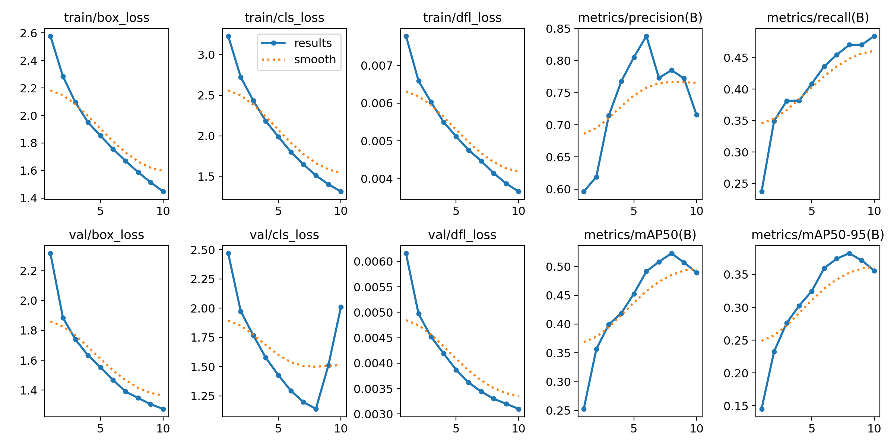
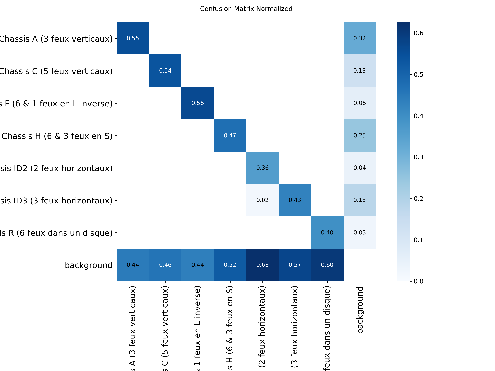
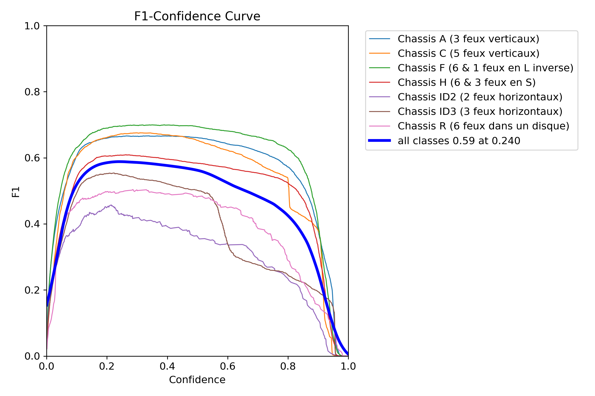
The training is a bit slow. I think using the 'm' size is a bad idea the 'n' should be enough and train faster. I also need to add weight_decay as my model stop training and it's seems it's not overfitting.

## Second training (train_scanner4)
I did 10 epochs with new params on 'yolo26n'
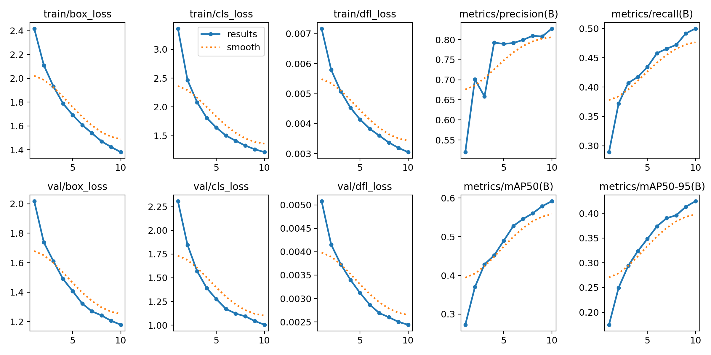
It seems we can train more there is no overfitting and the model seems to adapt i need to try more epochs.

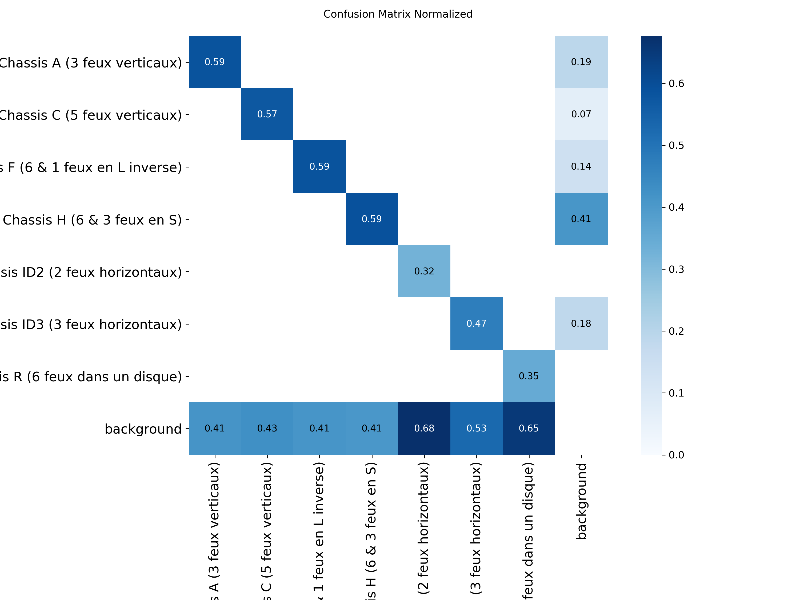
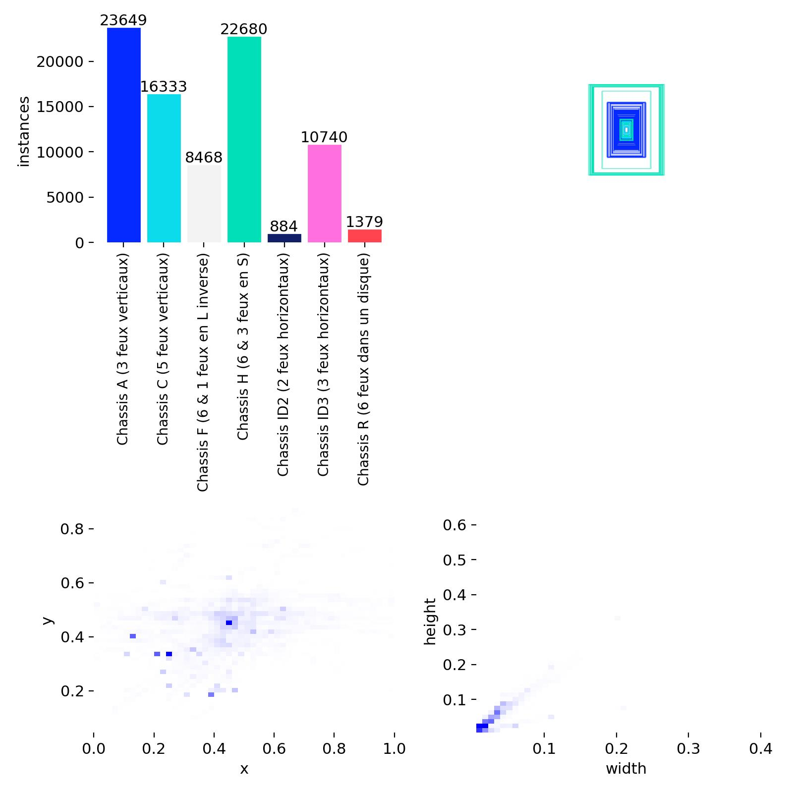
As the dataset is not balanced some classes are better than the other. To solve that i can either:
- See if it gets better with more epochs
- Use a loss for unbalanced classes

It should also help improving R
## Third Training
This trzining was done after the first test of the complete system. What i imagined was true, the ffmpeg creates artefacts and reduce the performance of the model.

I added these parameters:

```python
# video compression related
  hsv_s: 0.6  # light variation
  hsv_v: 0.6  # luminance variation
  imgsz: 640         
  scale: 0.5  # small zooms
  
  # for unbalanced class
  mosaic: 1.0 #
  mixup: 0.15 #
  copy_paste: 0.3 #
```

I get:
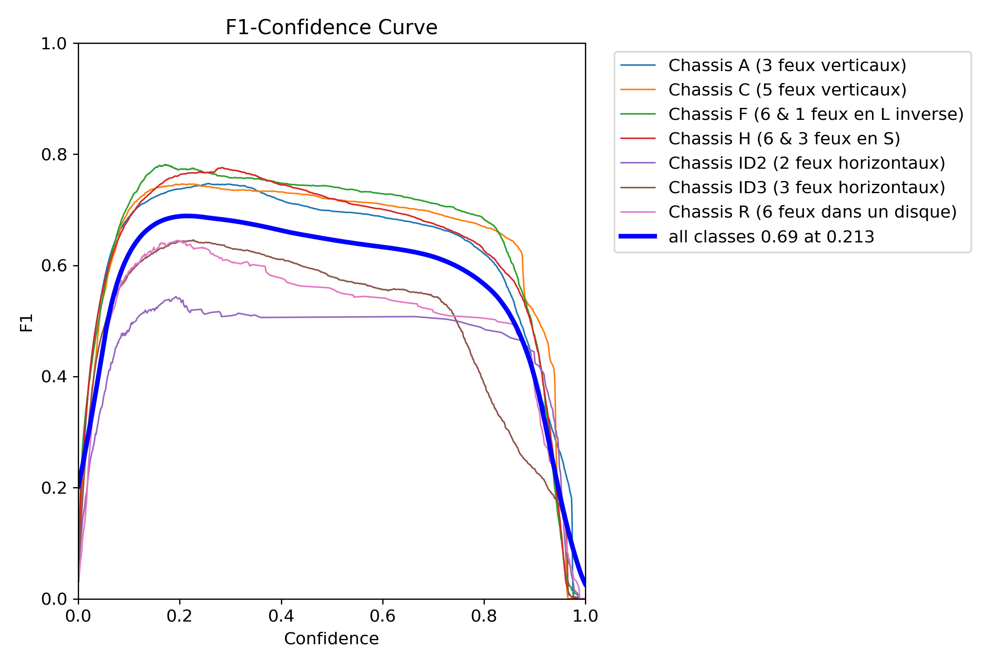
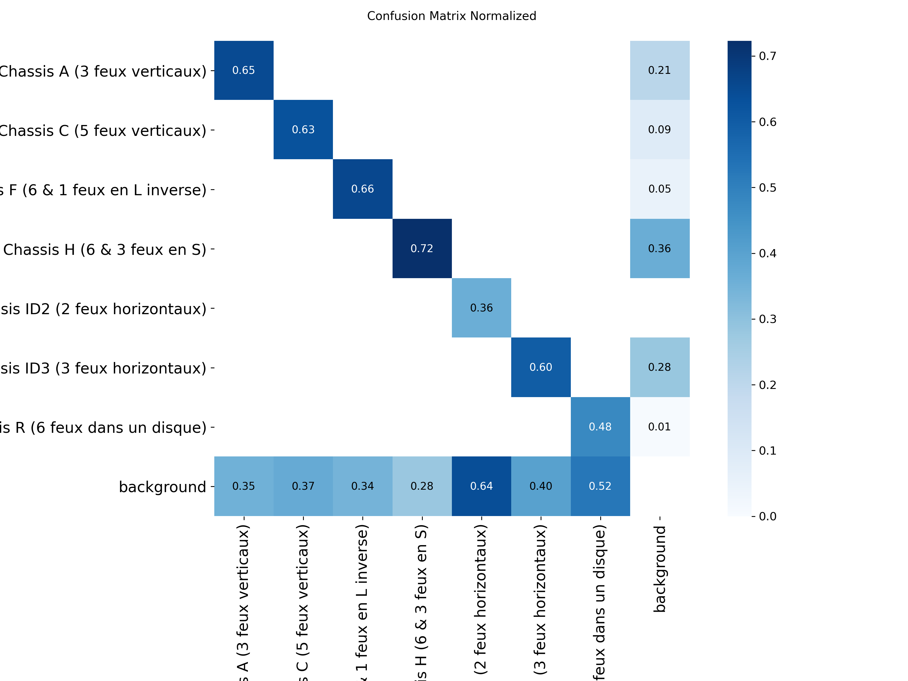
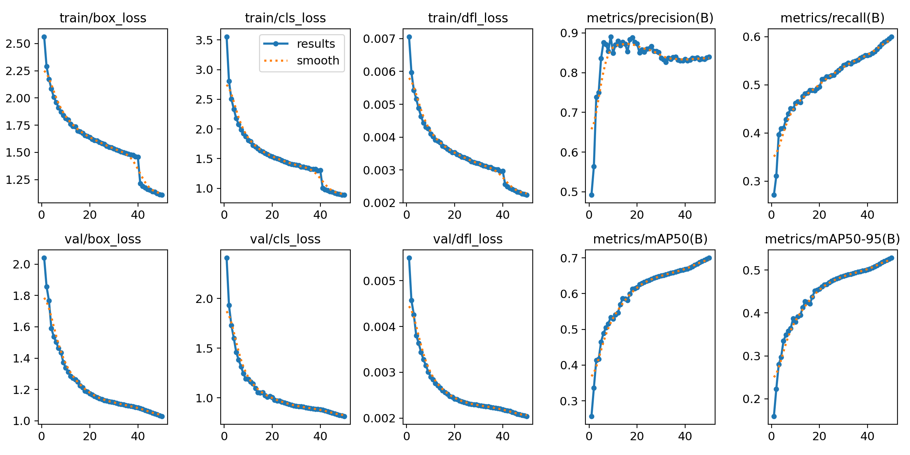

Those are way better results on the val but we need to test it on the full sytem.
# Conversion to ONNX/openVivo and quantization
To convert I use ./src/models/conversion.py
First i did convert to INT8 Conversion, it was working on my laptop but wasnt working on the pi:

--> switching to fp16

# Testing model on PC CPU
To test if the performance are either slow or degrated i test it on the PC CPU before switching to the raspberry pi with ./src/models/conversion.py

# Raspberry pi
As i want a real time system. I need to exectute different threads.
I have 3 threads :
- One for RTSP connexion to capture the frames and updating a single image buffer. 
- One for the AI inference
- One for the MQTT protocol and sending back the results

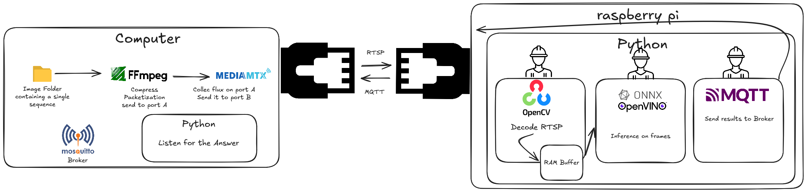

# Raspberry OS

I need to gain ram and cpu calculus os i will take a specific os from raspberry pi imager.


First i delete everything on the SD card and mount a new volume

# Communication

The use case of this project is in High speed railway. Thus, we need to chose a good protocol for our case. In the review of ***Paula Fraga-Lamas*** we are in the Intra-Car use-case. --> real time ethernet or Wi-Fi (802.11ac/ad). We need a 98-99% disponibility and a minus 100ms latency.

First i will start with ethernet. (For Wifi more security is needed and public wifi can create interference). We suppose the ethernet cable is 100m maximum.

I have two communication:

1. Between the sensor and the raspberry-pi --> I need to use RTSP protocol to send videos
2. Between the raspberry-pi and the train computer --> I need MQTT to send Json of the result

## Establishing the connection (WAN)
First i will select a static ip for my ethernet port on my pc:
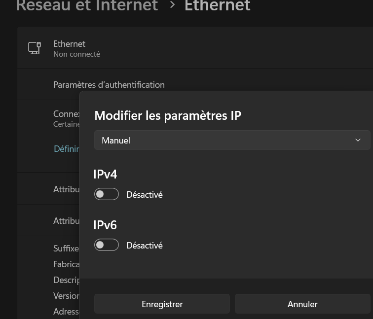
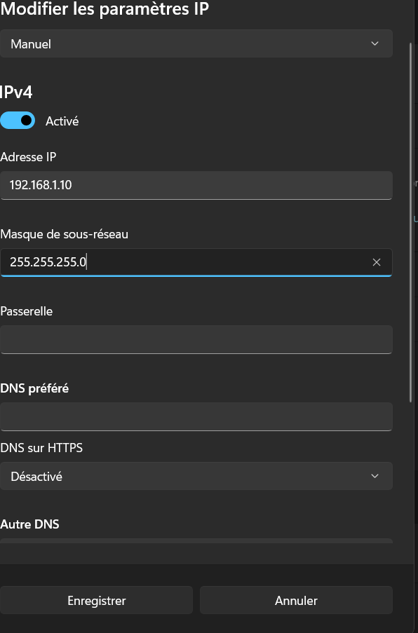

Second i do the same with the raspberry:
 On the terminal:
 ```bash
 sudo nano /etc/dhcpcd.conf
 ```
To modify network configuration
And add at the end of the file:
 ```bash
interface eth0
static ip_address=192.168.1.11/24
```
save with ctrl+O and quit with ctrl+x (I always forget how to save and quit in bash)

## Testing the connection
ping 192.168.1.11 on the pi should result in:

Answer from 192.168.....

## Installing ffmpeg and mediamtx
I do it directly on windows powershell:
[ffmpeg](https://lecrabeinfo.net/tutoriels/installer-ffmpeg-sur-windows/#installer-ffmpeg-sur-windows)


## Sending video to mediamtx:
[ffmpeg library](https://ffmpeg.org/ffmpeg.html)
From this: ffmpeg [global_options] {[input_file_options] -i input_url} ... {[output_file_options] output_url} ... 

```bash
ffmpeg -re -stream_loop -1 -start_number 4 -framerate 30 -i seq83_img%d.jpg -c:v libx264 -preset ultrafast -tune zerolatency -f rtsp rtsp://localhost:8554/chassis
```

Here it's 30 fps and infinite. We send in H.264 and prefere speed to compression. Sending the images as soon as they are ready.

### Improving ffmpeg
```bash
ffmpeg -re -stream_loop -1 -start_number 4 -framerate 30 -i seq83_img%d.jpg -c:v libx264 -preset medium -crf 18 -maxrate 8M -bufsize 16M -pix_fmt yuv420p -g 30 -keyint_min 30 -tune zerolatency -f rtsp rtsp://localhost:8554/chassis
```
The H.264 is quality 18. We control the bitrate. And send a full image (i-frame) every second. We also send with luminance chrominance colors.

### Final version of ffmpeg 
```bash
ffmpeg -re -stream_loop -1 -start_number 4 -framerate 30 -i seq83_img%d.jpg -vf "scale=640:640" -c:v libx264 -preset ultrafast -crf 20 -pix_fmt yuvj420p -g 30 -tune zerolatency -f rtsp -rtsp_transport udp rtsp://localhost:8554/chassis
```
H.264 quality 20. More color range, UDP protocol.
UPD: When there is a packet loss we ignore it and continue. As the framerate is 30 fps is doesnt change anything.


## Mosquitto to get the mqtt messages

Once installed i need to give permissions for systems outside of windows

in:

```bash
C:\Program Files\mosquitto\mosquitto.conf
```
I add:
```bash
listener 1883
allow_anonymous true
```
To restart services:
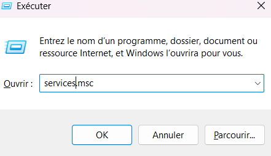
Then to test:
```bash
PS C:\Users\maxmo> netstat -an | findstr 1883
  TCP    0.0.0.0:1883           0.0.0.0:0              LISTENING
```

##  Issue on the PI to send MQTT send on wlan0 instead of eth0
```bash
sudo ip route add 192.168.1.10 dev eth0
```

On this step your antivirus software or firewall may block the MQTT.


## Creating the video
The data i send is from the validation of the yolo but i only want to test it so i wont send everything. 
One video for a PoC shoud be enough so i take the sequence 83. Using create_video I create a specific folder.
I get 57 images.


# Future and improvments

- Latency measures
- Raspberry ressource monitoring
- Security and redundancy
- Extend to off_track
     