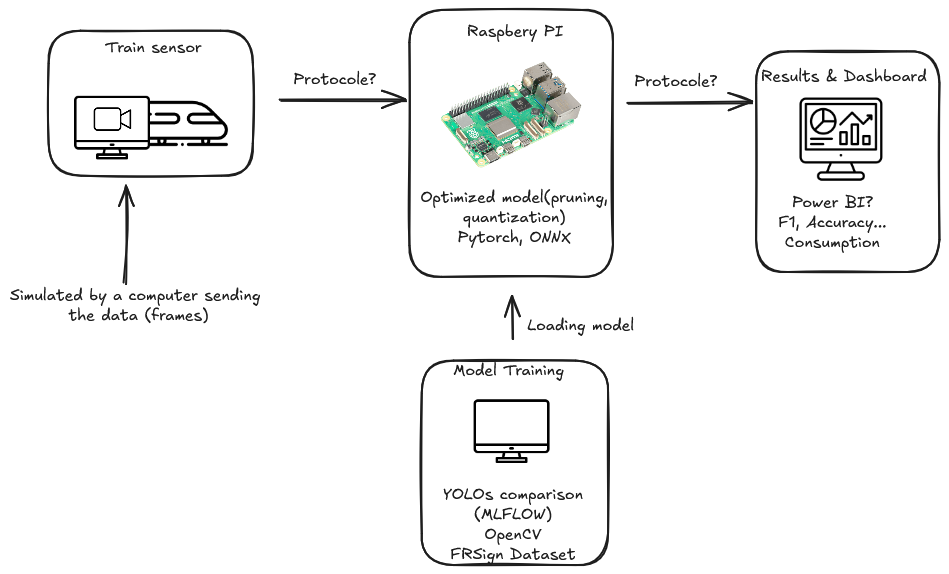
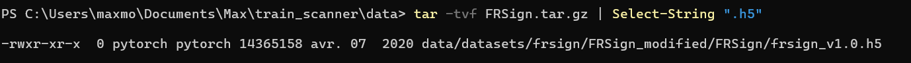
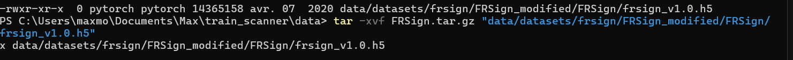

# TRAIN_SCANNER


The main goal is to create a real time system (Raspberry pi) that receive data and perform detection. Once the detection done the result is sent back to a computer.
The model used in the Raspberry is trained in a normal computer (no cloud needeed) and results are composed of different metrics and consumption analysis.


# Sources (not ordered)

- Ultralytics [Yolo](https://docs.ultralytics.com/fr/)

- [mlflow](https://mlflow.org/)

- [pytorch](https://pytorch.org/)

- [ONNX](https://onnx.ai/)

# Data Sources

I will use FRSIGN dataset : [FRSIGNDATASET](https://frsign.irt-systemx.fr/)

Citation :
>@ARTICLE{2020arXiv200205665H,
       author = {{Harb}, Jeanine and {R{\'e}b{\'e}na}, Nicolas and {Chosidow}, Rapha{\"e}l and {Roblin}, Gr{\'e}goire and {Potarusov}, Roman and {Hajri}, Hatem},
        title = "{FRSign: A Large-Scale Traffic Light Dataset for Autonomous Trains}",
      journal = {arXiv e-prints},
     keywords = {Computer Science - Computers and Society, Computer Science - Computer Vision and Pattern Recognition, Computer Science - Machine Learning},
         year = "2020",
        month = "Feb",
          eid = {arXiv:2002.05665},
        pages = {arXiv:2002.05665},
archivePrefix = {arXiv},
       eprint = {2002.05665},
 primaryClass = {cs.CY},
       adsurl = {https://ui.adsabs.harvard.edu/abs/2020arXiv200205665H},
      adsnote = {Provided by the SAO/NASA Astrophysics Data System}
}
>


# Getting Started

To use this repo you need to:

# Workflow


# Handling the dataset

The dataset is more than 250Go I just want to do a Proof of Concept. So i dont need to use all the data to do a perfect model with the best accuracy. The principal point are the communication and the inference in the raspberry pi.

First I need to Download it :

```bash
>>     Write-Host "Lancement du téléchargement..." -ForegroundColor Cyan
>>     curl.exe -L -C - -O https://frsign.irt-systemx.fr/download/FRSign.tar.gz
>>     if ($LASTEXITCODE -ne 0) {
>>         Write-Host "Connexion perdue. Relance dans 5 secondes..." -ForegroundColor Yellow
>>         Start-Sleep -s 5
>>     }
>> } while ($LASTEXITCODE -ne 0)
```
The goal here is having a Implement a resilient download strategy with auto-resume capabilities to ensure dataset integrity over my unstable and slow wifi

## Table of contents 

From the jupyter file we can see there is a 'table of contents' in the .h5 file. To create a smaller Dataset i will use that.

We can see it's only 14Mo. So i need to extract it.

Now i have a frsign_v1.0.h5 file in:
```bash
 \data\data\datasets\frsign\FRSign_modified\FRSign 
 ```
```bash
 With  ***explore_data*** we get the data structure: 
 Clés disponibles : ['/dataframe', '/images']

--- Structure du DataFrame ---
<class 'pandas.core.frame.DataFrame'>
Index: 393 entries, 83 to 1149
Data columns (total 14 columns):
 #   Column                       Non-Null Count  Dtype
---  ------                       --------------  -----
 0   CameraInfo_bayerTileFormat   393 non-null    object        
 1   CameraInfo_sensorResolution  393 non-null    object        
 2   context                      393 non-null    object        
 3   datetime                     393 non-null    datetime64[ns]
 4   fps                          393 non-null    float64       
 5   sensor_id                    393 non-null    object        
 6   sensor_type                  393 non-null    object        
 7   state                        393 non-null    object
 8   type                         393 non-null    object
 9   on_track                     393 non-null    bool
 10  video                        393 non-null    object
 11  video_name                   393 non-null    object
 12  optic                        393 non-null    int64
 13  image_format                 393 non-null    object
dtypes: bool(1), datetime64[ns](1), float64(1), int64(1), object(10)
memory usage: 43.4+ KB
None

--- Aperçu des données ---
         CameraInfo_bayerTileFormat CameraInfo_sensorResolution  ... optic image_format
sequence                                                         ...
83                             RGGB                   1920x1200  ...    25         PNG8
124                            RGGB                   1920x1200  ...    25         PNG8
128                            RGGB                   1920x1200  ...    25         PNG8
129                            RGGB                   1920x1200  ...    25         PNG8
164                            RGGB                   1920x1200  ...    25         PNG8

[5 rows x 14 columns]

--- Exploring images ---
fullpath of first image: RecFile_1_20181011_153137_pointgrey_flycapture2_1_ipl_image/33734_rgb.png
Index(['fullpath', 'x', 'y', 'w', 'h'], dtype='object')
                                                         fullpath    x    y   w   h
sequence image
83       0      RecFile_1_20181011_153137_pointgrey_flycapture...  882  528  15  21
         1      RecFile_1_20181011_153137_pointgrey_flycapture...  882  528  15  21
         2      RecFile_1_20181011_153137_pointgrey_flycapture...  882  528  15  21
         3      RecFile_1_20181011_153137_pointgrey_flycapture...  882  528  15  21
         4      RecFile_1_20181011_153137_pointgrey_flycapture...  882  528  15  21
Shape of images dataset: (105352, 5)
```
# Communication

The use case of this project is in High speed railway. Thus, we need to chose a good protocol for our case. In the review of ***Paula Fraga-Lamas*** we are in the Intra-Car use-case. --> real time ethernet or Wi-Fi (802.11ac/ad). We need a 98-99% disponibility and a minus 100ms latency.

First i will start with ethernet. (For Wifi more security is needed and public wifi can create interference). We suppose the ethernet cable is 100m maximum.

I have two communication:

1. Between the sensor and the raspberry-pi --> I need to use RTSP protocol to send videos
2. Between the raspberry-pi and the train computer --> I need MQTT to send Json of the result

The MQTT message is more important it is sent when something important is detected. We need to make sure detection are sent to the computer.

So i will use Quality of Service (QoS): --> QoS1

With the issue of --> i will also need to compress the frames in H.264 720p and select FPS

## Quality of Service (QoS)
1. Bandwidth :
  - maximum capacity of data transmission (in Mbps).
  - In our case we need to prioritize the MQTT ones in case of limited bandwidth
2. Delay / latency :
  - Time of travel for an information
  - ethernet cable is 100m max: Latency = \frac{Distance}{Speed} = \frac{100}{\simeq 2\times 10^{8}} = 0.5µs it's negligeable. So Latency will come mainly from the raspberry pi during the image processing.
3. Loss :
  - When a packet doesnt end at the destination
  - If some frames disappear there is no issue if the following one is there but for the MQTT message we need to be sure it's sent
4. Jitter :
  - Variance of Delay/Latency  (regularity of the flux)
  - With Ethernet should not be an issue
5. Availability :
  - %time of operationnal 
  - as long as the cable is connected
    


